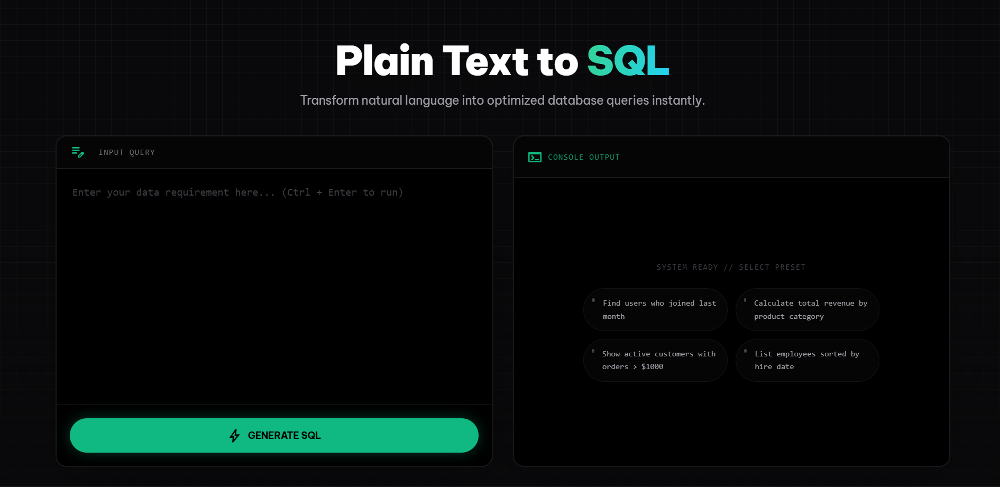
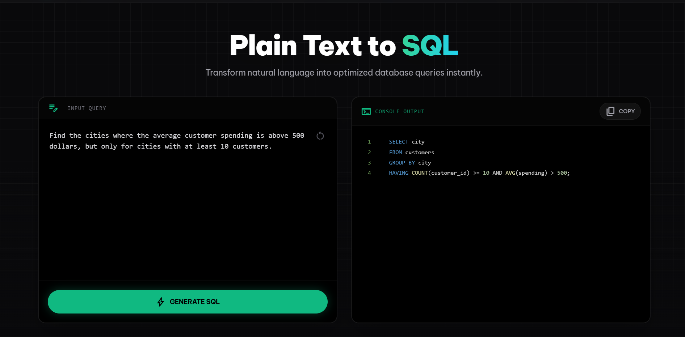

 <br>
An application that converts text to sql. The front end is made using react and tailwind while the backend is completely written in python. We used the help of qwen-32B model to convert the text to SQL. This project was initially built for a Speakspace hackathon with the help of **[@anadhikag](https://github.com/anadhikag)**, **[@AnnaIsson](https://github.com/AnnaIsson)** and **[@joel-dsilva](https://github.com/joel-dsilva)** and we decided to make a frontend for it as it would help us out in Data Base Management Systems. You can access the website [here](https://texttosql.pages.dev/). 

### Output screenshots



### Installation & Setup

Follow these steps to get the project running on your local machine.


#### 1. Clone the Repository
```bash
git clone [https://github.com/Aarxn-Jibz/TextToSQL.git](https://github.com/Aarxn-Jibz/TextToSQL.git)
cd TextToSQL
```
#### 2. Setup
Run 
```bash
npm install react-syntax-highlighter
```

#### 3. Run
Start the service by running
```bash
npm run dev
```
It will typically open in  http://localhost:5173.